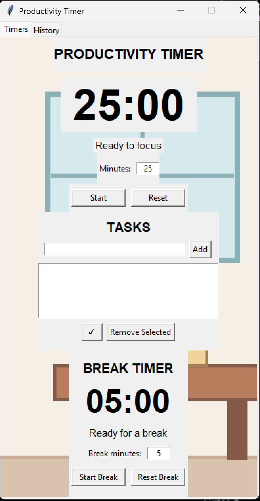

# Productivity application made in python
Made with AI: This is a pomodoro style timer to help with productivity, and managing ones time well, without overdoing it. 

## Technologies/Languages used: 
- Python

## How to Run: 
- Clone this repository
- Run code in your terminal/download file
- Open and use as is!

## Features:
- Dorm room backround, with interactive sun and moon to change from day to night mode.
- History tab to see what one has has already done
- Two central timers to track how long you've been working

