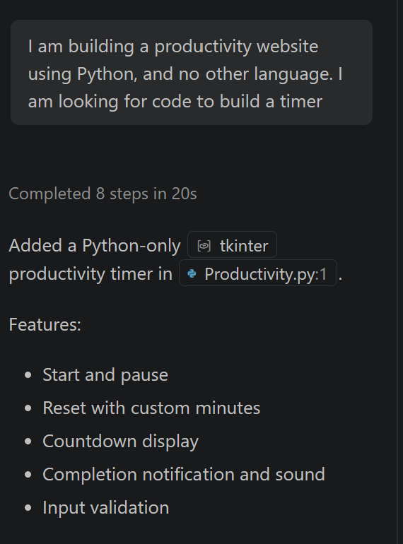
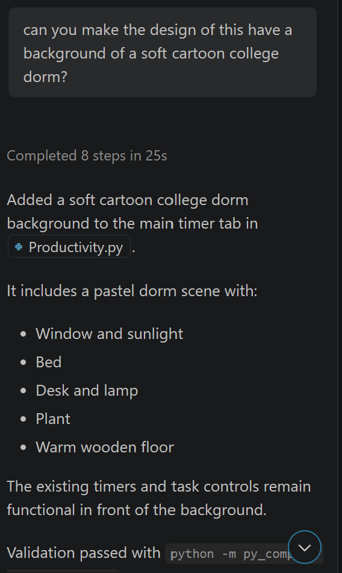
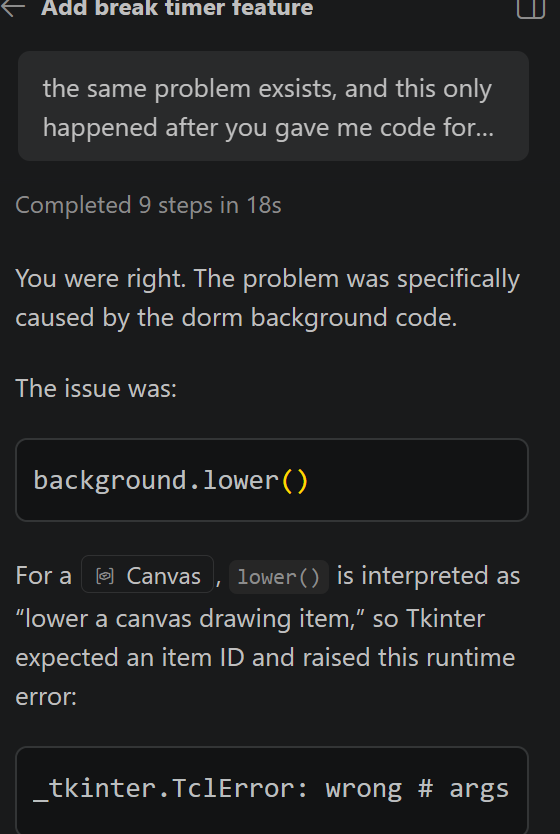
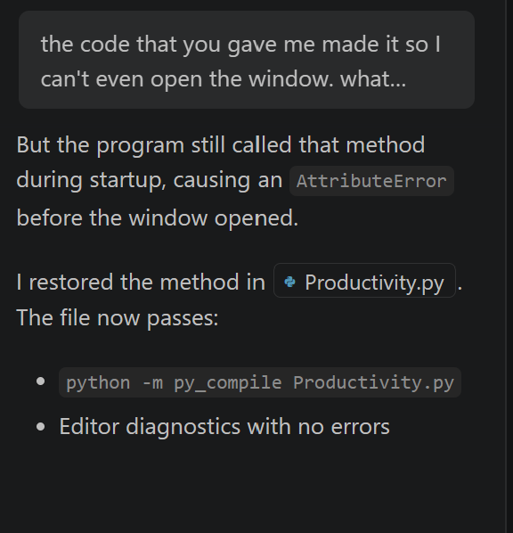
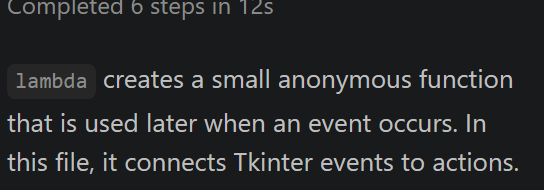
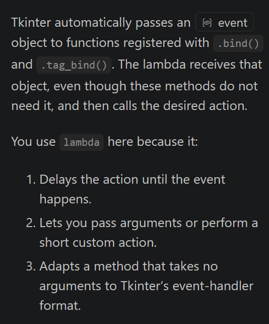
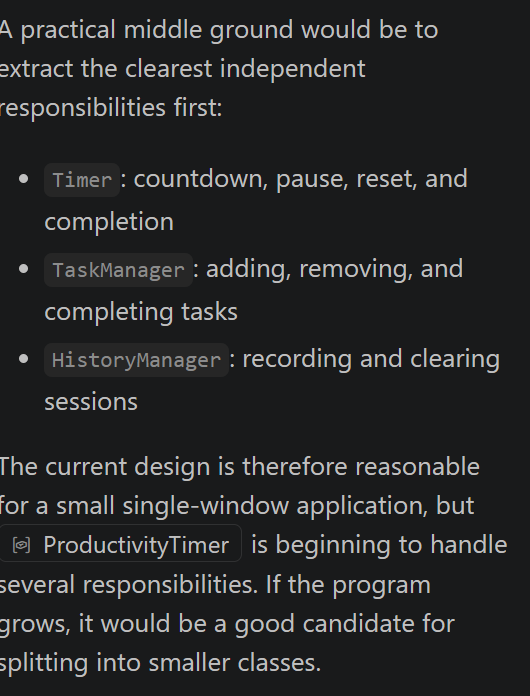

# Reflection for this project

## What did you ask Copilot to help you build? How did you break down the problem?
Copilot helped me build a productivity application because I have always liked those pomodoro timers online. The way I went about breaking this down was by asking myself 'what is the basic thing I am trying to make?' and in this case, it was a productivity app, so the conclusion I came to was that this is simply a timer for a specific time (usually about 25 min) made to look pretty. So after I had the basic timer in place along with a break timer, the rest of the time was making the page look pretty. 

## How did your approach to asking questions change as you worked?
 At first, my questions were based on how the code worked,  and instructions based on what I was trying to make as seen below. 

at one point though there was as piece of code I had the AI add in and the code made it so that I could click on the file to open the app, but the application would open as a brief black page and then close itself out with no other reasoning. 

After some time going back and forth, there was an incorectly called method in the code:

After I fixed this, it then changed how I approached asking AI to do things so that it would check the lines of code that it put in *before* I would try to run the file (I would double check just to make sure though). 

## What parts of the development process with GitHub Copilot surprised you?
what surprised me more than I thought it would was the AI's insitence that code was working when in reality it wasn't as seen below. This I saw when working with creating the background of the app and as I mentioned above, it changed my approach in how I phrased things, but it was having the AI tell me what I wanted to hear that really suck with me throughout the process, because, it has become a bit of a joke around the place I live to hear that AI will give you what you want to hear, but to see and experience it first heand really gave me a bit of sticker shock.

## What did you learn about the technology you used that you didn't know before?
I chose to code in soley Python because it is a language I am more familiar with than any of the other possibilities*, and I wanted to retain the ability to be able to catch AI when it messed up rather than having to rely on it. This exercise however gave me the oppurtunity to learn more about object-oriented programming and using classes in a way I hadn't seen before and it expanded my knowledge about the use of those things. I ended up asking AI why it used the "lambda" function so much and why it only used one class for the whole file rather than breaking the functions of the app up into many different functions. As seen below, the AI gives answers as to why. 

I thought the explaination on the use of one class rather than many was most helpful for me to understand how they work, as this is a subject that in the past I tended to struggle to grasp. 

## What would you do differently if you had to build this again?
If I had to do this all again, I would probably write out exactly what I wanted in the app, and all of the little design elements I knew I wanted so I had a set plan or goal  as to what I wanted to create, and really focus in on the specifics of the app as I did not really have an end goal in mind; rather I was just exploring to see what the AI could do. Another thing I would do differently would be to manually type what the AI gave me if given the option, so that as my fingers are moving, my brain is making connections that I otherwise might not have made. While this opens up the oppurtunity for *me* to make mistakes, they are in a way necessary for me to learn what each function does and how objects interact with each other becuase I tend to learn by doing rather than simply gathering theory about the thing I'm learning (although I do not discount the weight that knowing the "why" behind something that is theory). Something else I would also keep in mind that the AI is going to give me what it thinks what I want to hear, so to be cautious of what it gives me and being scrupulous in the changes I do allow it to make. 